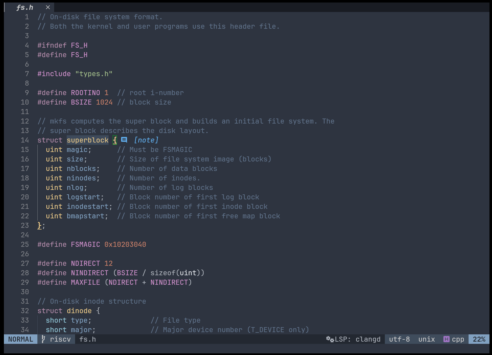

# aside.nvim

A simple Neovim plugin for creating code annotations. Useful if you are studying or deep diving a codebase but hate cluttering code files with lengthy and dense comments.

## Demo


## TODO

### Future Features
- [x] Improve storage layer - implement proper indexing, add data validation, consider SQLite migration
- [x] Better line tracking - implement fuzzy matching when code changes and lines shift
- [x] LSP hover integration
- [ ] Search across all annotations
- [ ] Bulk delete annotations in a file
- [ ] Export annotations to markdown
- [ ] Annotation categories/tags
- [ ] Git integration for smarter line tracking
- [ ] Performance optimization - reduce latency when loading/displaying annotations

## Features

- Add annotations to any line of code
- SQLite storage with automatic migration from JSON
- Indexed queries for fast lookups
- Visual indicators (virtual text or signs) mark annotated lines
- Toggle indicator visibility
- Global or per-project storage
- Export to JSON for backups
- LSP hover integration (opt-in)

## Requirements

- Neovim 0.9+
- [nui.nvim](https://github.com/MunifTanjim/nui.nvim)
- [sqlite.lua](https://github.com/kkharji/sqlite.lua) (recommended)
  - Requires sqlite3 binary on your system
  - Falls back to JSON if unavailable (not actively maintained)

## Installation

### lazy.nvim

```lua
{
  'fadli0029/aside.nvim',
  dependencies = {
    'MunifTanjim/nui.nvim',
    'kkharji/sqlite.lua',
  },
  config = function()
    require('aside').setup()
  end,
}
```

### packer.nvim

```lua
use {
  'fadli0029/aside.nvim',
  requires = {
    'MunifTanjim/nui.nvim',
    'kkharji/sqlite.lua',
  },
  config = function()
    require('aside').setup()
  end,
}
```

## Configuration

```lua
require('aside').setup({
  -- Storage path (default: ~/.local/share/nvim/aside)
  storage_path = vim.fn.stdpath('data') .. '/aside',

  -- Keymaps
  keymaps = {
    add = '<leader>aa',
    view = '<leader>av',
    delete = '<leader>ad',
    toggle = '<leader>at',
    list = '<leader>al',
  },

  -- UI settings
  ui = {
    border = 'rounded',
    width = 80,
    height = 20,
  },

  -- Indicators
  indicators = {
    enabled = true,
    style = 'virtual_text',  -- or 'signs'
    icon = '󰍨 ',
    text = ' [note]',
  },

  -- Line tracking
  tracking = {
    search_range = 10,  -- lines to search when reconciling moved annotations
  },

  -- LSP integration
  lsp = {
    hover = false,  -- show annotations in LSP hover popup
  },
})
```

## Usage

**Add annotation:** Position cursor on a line and press `<leader>aa`. Write content in the popup and save with `<C-s>`. Press `q` in normal mode to cancel.

**View annotation:** Press `<leader>av` on an annotated line to view or edit. In the popup: `<C-s>` to save, `<C-d>` to delete, `q` to close.

**List annotations:** Press `<leader>al` to see all annotations in the current file. Press `<Enter>` to jump to an annotation, `q` to close.

**Toggle indicators:** Press `<leader>at` to hide/show annotation markers.

**Commands:**
```vim
:Aside add          " Add annotation at current line
:Aside view         " View/edit annotation at current line
:Aside list         " List all annotations in current file
:Aside toggle       " Toggle annotation indicators
:Aside export       " Export annotations to JSON (default: storage_path/annotations_export.json)
:Aside export path  " Export annotations to custom path
:Aside info         " Show storage backend info (SQLite or JSON)
```

## LSP Hover Integration

When enabled with `lsp.hover = true`, annotations appear in LSP hover popups alongside language server documentation. The feature wraps the existing hover handler, preserving any custom LSP configurations.



## Storage

Default storage location is `~/.local/share/nvim/aside/`.

**SQLite** (recommended): Install `sqlite.lua` to use `annotations.db` with indexed queries and transactions. Existing JSON data migrates automatically with backup at `annotations.json.backup`.

**JSON** (fallback): Used when `sqlite.lua` is unavailable. Reads entire file for each operation. Not actively maintained.

For per-project storage, set `storage_path = '.aside'` in config.

## License

MIT
